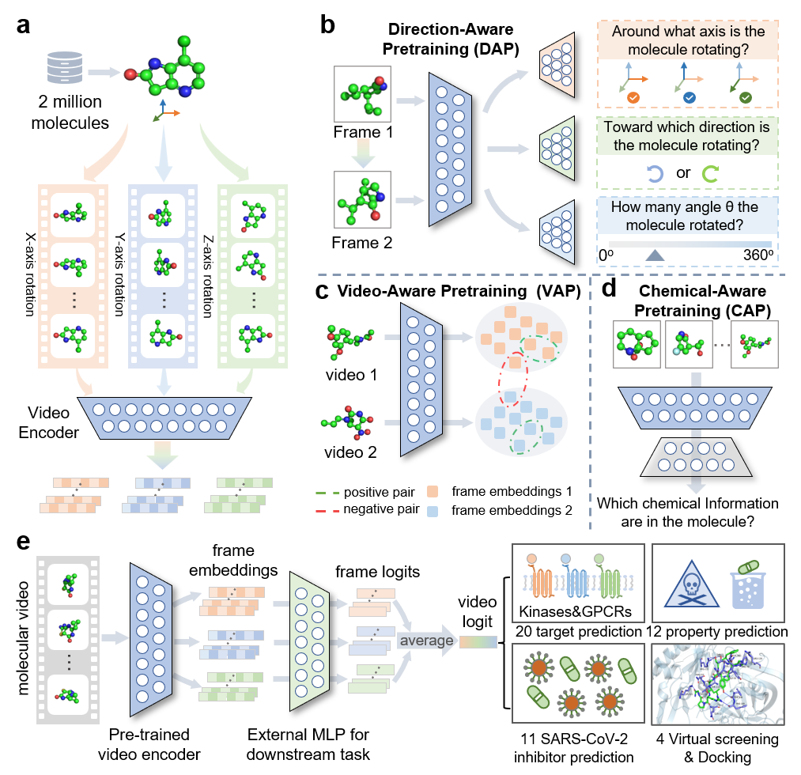
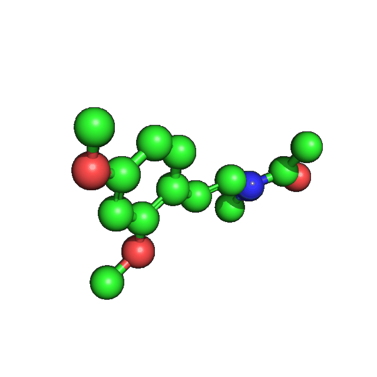
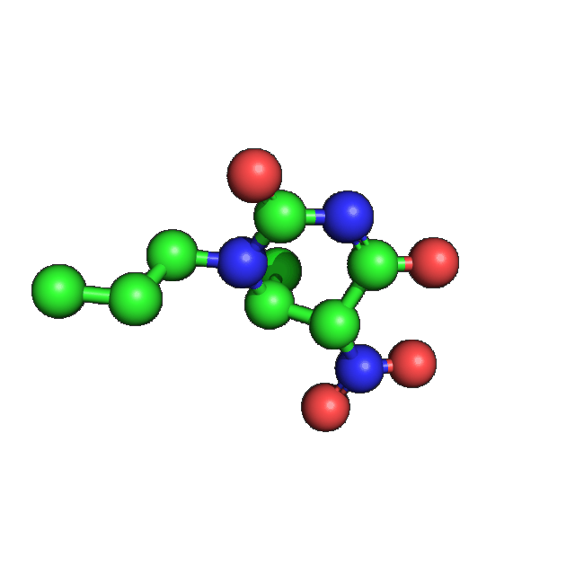
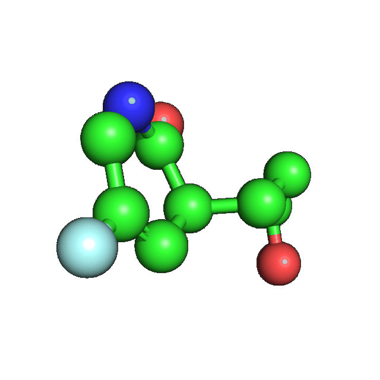
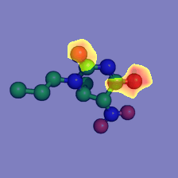

# VideoMol

**Official PyTorch-based implementation of Paper "A Molecular Video-derived Foundation Model for Scientific Drug Discovery"**




## News!

**[2023/11/05]** Repository installation completed.


## What is Molecular Video?

Author Note: Molecules are constantly moving in nature and video is a natural way to describe dynamic scenes. This was our initial idea when exploring Video. It is the most natural idea to build a video of molecular conformational changes, but we did not do so. One of the reasons is that molecular dynamics simulations rely on a lot of computing resources. For this reason, we took another approach to represent the conformation of a single molecule as a video and construct pre-training tasks from the perspective of video understanding. This can enhance the representation of molecules while having good scalability (can be easily extended to dynamics simulation data in the future).

Having said so much, the video constructed by VideoMol is as follows:

<details>
  <summary>Click here to watch the molecular video!</summary>

|  |  |  |  |
| ------------------------------------------------------------ | ------------------------------------------------------------ | ------------------------------------------------------------ | ------------------------------------------------------------ |
</details>

When the model is inferring, it obtains prediction results by scanning all frames.

<details>
  <summary>Click here to watch the inference!</summary>

  

</details>

## Environments

#### 1. GPU environment

CUDA 11.6

Ubuntu 18.04


#### 2. create conda environment

```bash
# create conda env
conda create -n videomol python=3.9
conda activate videomol

# install environment
pip install rdkit -i https://mirrors.tuna.tsinghua.edu.cn
pip install torch==1.13.1+cu116 torchvision==0.14.1+cu116 torchaudio==0.13.1 --extra-index-url https://download.pytorch.org/whl/cu116
pip install timm==0.6.12
pip install tensorboard
pip install scikit-learn
pip install setuptools==59.5.0
pip install pandas
```


## Data processing

#### 1. Generating 3D conformation for your data

We use RDKiT[<sup>1</sup>](#ref1) to generate a 3D conformation for each molecule if the molecules do not have a conformation. Here is the code snippet to generate the 3D conformation:

<details>
  <summary>Click here for the code!</summary>

```python
def generate_3d_comformer(smiles, sdf_save_path, mmffVariant="MMFF94", randomSeed=0, maxIters=5000, increment=2, optim_count=10, save_force=False):
    count = 0
    while count < optim_count:
        try:
            m = Chem.MolFromSmiles(smiles)
            m3d = Chem.AddHs(m)
            if save_force:
                try:
                    AllChem.EmbedMolecule(m3d, randomSeed=randomSeed)
                    res = AllChem.MMFFOptimizeMolecule(m3d, mmffVariant=mmffVariant, maxIters=maxIters)
                    m3d = Chem.RemoveHs(m3d)
                except:
                    m3d = Chem.RemoveHs(m3d)
                    print("forcing saving molecule which can't be optimized ...")
                    mol2sdf(m3d, sdf_save_path)
            else:
                AllChem.EmbedMolecule(m3d, randomSeed=randomSeed)
                res = AllChem.MMFFOptimizeMolecule(m3d, mmffVariant=mmffVariant, maxIters=maxIters)
                m3d = Chem.RemoveHs(m3d)
        except Exception as e:
            traceback.print_exc()
        if res == 1:
            maxIters = maxIters * increment
            count += 1
            continue
        mol2sdf(m3d, sdf_save_path)
    if save_force:
        print("forcing saving molecule without convergence ...")
        mol2sdf(m3d, sdf_save_path)
```

</details>


#### 2. Rendering molecular video

We use PyMOL[<sup>2</sup>](#ref2) to render each frame of molecular video, which is a user-sponsored molecular visualization system on an open-source foundation, maintained and distributed by Schrödinger. You can get it for free from [the link](https://pymol.org/2/).

Here is the PyMOL script to get the molecular frame, you can run it in the PyMOL command:

<details>
<summary>Click here for the code!</summary>

```bash
sdf_filepath=demo.sdf
rotate_direction=x  # x,y,z
rotate=30  # any angle from 0~360
save_img_path=demo_frame.png
load $sdf_filepath;bg_color white;hide (hydro);set stick_ball,on;set stick_ball_ratio,3.5;set stick_radius,0.15;set sphere_scale,0.2;set valence,1;set valence_mode,0;set valence_size, 0.1;rotate $rotate_direction, $rotate;save $save_img_path;quit;
```

</details>

With the above code, you will get frames with 640x480 pixels. 


#### 3. Video post-processing

For each frame of the video, run the following code to get a 224x224 pixel frame.

<details>
<summary>Click here for the code!</summary>


```python
def padding_white_and_resize(img_path, trt_path, new_h, new_w, resize_h, resize_w):
    ImageFile.LOAD_TRUNCATED_IMAGES = True
    if imghdr.what(img_path) == "png":
        Image.open(img_path).convert("RGB").save(img_path)

    img = cv2.imread(img_path)
    img = cv2.cvtColor(img, cv2.COLOR_BGR2RGB)

    h, w, c = img.shape

    new_img = np.ones(shape=(new_h, new_w, 3)) * 255

    assert (new_w - w) % 2 == 0 and (new_h - h) % 2 == 0
    left, right, top, bottom = (new_w - w) // 2, (new_w - w) // 2 + w, (new_h - h) // 2, (new_h - h) // 2 + h
    new_img[top:bottom, left:right] = img
	
    new_img = Image.fromarray(new_img.astype(np.uint8))
    out = new_img.resize((resize_h, resize_w), Image.ANTIALIAS)
    out.save(trt_path)

# run demo:
padding_white_and_resize(img_path, trt_path, new_h=640, new_w=640, resize_h=224, resize_w=224)  # img_path is a 640x480 frame. padding 640x480 to 640x640 and then resizing 640x640 to 224x224
```

</details>


## 🔥Pre-training

#### 1. Preparing dataset for pre-training

You can download provided [pretraining data](https://drive.google.com/file/d/1RkzYcJUQUtp5sqQis-mQvzurSznLkh2N/view?usp=sharing) and push it into the folder `datasets/pre-training/`. 

Note that larger pre-training data means more storage space is required. You have free access to all pre-trained datasets in [PCQM4Mv2](https://ogb.stanford.edu/docs/lsc/pcqm4mv2/)[<sup>3</sup>](#ref3), of which we use the first 2 million molecules.


#### 2. Pre-train VideoMol

Usage:

```bash
usage: pretrain_videomol.py [-h] [--dataroot DATAROOT] [--dataset DATASET]
                            [--label_column_name LABEL_COLUMN_NAME]
                            [--workers WORKERS] [--nodes NODES]
                            [--ngpus_per_node NGPUS_PER_NODE]
                            [--dist-url DIST_URL] [--node_rank NODE_RANK]
                            [--model_name MODEL_NAME]
                            [--n_chemical_classes N_CHEMICAL_CLASSES]
                            [--n_frame N_FRAME] [--mode {mean,sum,sub}]
                            [--lr LR] [--momentum MOMENTUM]
                            [--weight-decay WEIGHT_DECAY] [--weighted_loss]
                            [--seed SEED] [--runseed RUNSEED]
                            [--start_epoch START_EPOCH] [--epochs EPOCHS]
                            [--batch BATCH] [--imageSize IMAGESIZE]
                            [--temperature TEMPERATURE]
                            [--base_temperature BASE_TEMPERATURE]
                            [--resume RESUME]
                            [--validation-split VALIDATION_SPLIT]
                            [--n_ckpt_save N_CKPT_SAVE]
                            [--n_batch_step_optim N_BATCH_STEP_OPTIM]
                            [--log_dir LOG_DIR]
```

For example, you can use the following command to pretrain VideoMol:

```bash
python pretrain_videomol.py \
--nodes=1 \
--ngpus_per_node=1 \
--model_name vit_small_patch16_224 \
--mode sub \
--n_batch_step_optim 1 \
--epochs 100 \
--batch 8 \
--weighted_loss \
--lr 1e-2 \
--ngpu 1 \
--workers 16 \
--dataroot ../datasets/pre-training/ \
--dataset video-1000-224x224 \
--label_column_name k100 \
--log_dir ./experiments/videomol/pretrain_videomol/
```


## 🔥Fine-tuning

####  1. preparing pretrained videomol

We provide the pre-trained model below, please download it and put it in the `ckpts/` directory.

| Model Name | Backbone              | #Params  | Checkpoints                                                  |
| ---------- | --------------------- | -------- | ------------------------------------------------------------ |
| VideoMol   | vit_small_patch16_224 | 21.742 M | [GoogleDrive](https://drive.google.com/file/d/1TitrL3ed5Wko_xJxornnXFp4DRJLW6ya/view?usp=sharing) |


#### 2. preparing downstream datasets

The downstream datasets can be accessed in following table:

| Name                          | Download link                                                | Description                          |
| ----------------------------- | ------------------------------------------------------------ | ------------------------------------ |
| GPCRs.zip                     | [OneDrive](https://1drv.ms/u/s!Atau0ecyBQNTgRhTW7aoX_ecTFLt?e=Ab7WyI) (RGB format) | 10 GPCR datasets (5HT1A, 5HT2A, ...) |
| MPP                           | [OneDrive](https://1drv.ms/f/s!Atau0ecyBQNTgRrf1iE-eogd17M-?e=m7so1Q) (BGR format) | Molecular property prediction        |
| SARS-CoV-2_REDIAL-2020.tar.gz | [OneDrive](https://1drv.ms/u/s!Atau0ecyBQNTgRmtGGcJQpKBrU3o?e=idhTHJ) (RGB format) | 11 SARS-CoV-2 datasets               |
| KinomeScan.zip                | [GoogleDrive](https://drive.google.com/file/d/1Q6yZEhB9ATNZxjZB9tR6zB_sm6B49aaM/view?usp=sharing) (RGB format) | 10 kinase datasets (BTK, EGFR, ...)  |
| Virtual Screening             | [OneDrive](https://1drv.ms/f/s!Atau0ecyBQNThjv-yUyDdgRCKpDR?e=PrRjaD) (RGB format) | BACE1、COX-1、COX-2、EP4             |
| DrugBank_Approved.tar.gz      | [OneDrive](https://1drv.ms/u/s!Atau0ecyBQNThjwFcDoYluXg5Dk9?e=lchCC8) (RGB format) | Approved molecules from DrugBank     |

Please download all data listed above and push them into the folder `datasets/fine-tuning/`


#### 3. fine-tuning with pretrained videomol

There are two modes for training VideoMol:

- [finetune_video.py](https://github.com/HongxinXiang/VideoMol/blob/master/finetune/finetune_video.py)
- [finetune_video_step.py](https://github.com/HongxinXiang/VideoMol/blob/master/finetune/finetune_video_step.py)

The motivation for the two modes is that we found that we could achieve good performance on the some datasets (such as HIV) with only one epoch when training VideoMol with `finetune-video.py`. We speculated that training VideoMol would not require many epochs. Therefore, we further wrote `finetune_video_step.py` to support training with a small number of epochs.


**Usage of finetune_video.py:**

```bash
usage: finetune_video.py [-h] [--dataroot DATAROOT] [--dataset DATASET]
                         [--label_column_name LABEL_COLUMN_NAME]
                         [--video_dir_name VIDEO_DIR_NAME] [--gpu GPU]
                         [--ngpu NGPU] [--workers WORKERS] [--lr LR]
                         [--momentum MOMENTUM] [--weight-decay WEIGHT_DECAY]
                         [--seed SEED] [--runseed RUNSEED]
                         [--split SPLIT]
                         [--split_path SPLIT_PATH] [--epochs EPOCHS]
                         [--start_epoch START_EPOCH] [--batch BATCH]
                         [--resume RESUME] [--arch {arch1,arch2,arch3}]
                         [--imageSize IMAGESIZE] [--model_name MODEL_NAME]
                         [--n_frame N_FRAME] [--close_image_aug]
                         [--task_type {classification,regression}]
                         [--save_finetune_ckpt {0,1}] [--log_dir LOG_DIR]
```

For examples:

```bash
# run on 5HT1A dataset
python finetune-video.py --dataroot ./datasets --dataset 5HT1A --batch 8 --lr 5e-05 --epochs 30 --split balanced_scaffold --arch arch3 --resume ./resumes/videomol.pth --task_type regression --seed 0 --runseed 0
```


**Usage of finetune_video_step.py:**

```bash
usage: finetune_video_step.py [-h] [--dataroot DATAROOT] [--dataset DATASET]
                              [--label_column_name LABEL_COLUMN_NAME]
                              [--video_dir_name VIDEO_DIR_NAME] [--gpu GPU]
                              [--ngpu NGPU] [--workers WORKERS]
                              [--warmup_rate WARMUP_RATE] [--lr LR]
                              [--momentum MOMENTUM]
                              [--weight-decay WEIGHT_DECAY] [--seed SEED]
                              [--runseed RUNSEED]
                              [--split {split_file,random,stratified,scaffold,random_scaffold,balanced_scaffold}]
                              [--split_path SPLIT_PATH] [--epochs EPOCHS]
                              [--start_epoch START_EPOCH] [--batch BATCH]
                              [--resume RESUME]
                              [--arch {arch1,arch2,arch3,arch4,arch5}]
                              [--imageSize IMAGESIZE]
                              [--model_name MODEL_NAME] [--n_frame N_FRAME]
                              [--close_image_aug]
                              [--task_type {classification,regression}]
                              [--save_finetune_ckpt {0,1}]
                              [--reg_mean_std {none,self}]
                              [--eval_step EVAL_STEP] [--dropout DROPOUT]
                              [--activation_fn {relu,gelu,tanh,softplus,linear}]
                              [--log_dir LOG_DIR]
```

For examples:

```bash
# run on HIV
python finetune_video_step.py --dataroot ./datasets/mpp-video --dataset hiv --split scaffold --resume ./resumes/videomol.pth --close_image_aug --runseed 0 --task_type classification --video_dir_name video-224x224 --arch arch4 --epochs 2 --batch 16 --lr 0.005 --dropout 0.5 --activation_fn gelu
```


## Reproducing Guidance

1.  Download the dataset from the "preparing downstream datasets" section.

2.  Click [this link](https://github.com/HongxinXiang/VideoMol/tree/master/scripts) to view the reproducibility guide.


## Docking Guidance

We have described the details of docking in [this tutorial](https://github.com/HongxinXiang/VideoMol/tree/master/tutorial/docking_guidance), and you can complete docking easily step by step.


## Other Resources

Other methods: [link](https://1drv.ms/f/s!Atau0ecyBQNTgTd736-8RPWEXSVt?e=DkOyw2)


# Reference

If you find our code or anything else helpful, please do not hesitate to cite the following relevant papers:

```bash
TODO...


@inproceedings{ijcai2024p675,
  title     = {An Image-enhanced Molecular Graph Representation Learning Framework},
  author    = {Xiang, Hongxin and Jin, Shuting and Xia, Jun and Zhou, Man and Wang, Jianmin and Zeng, Li and Zeng, Xiangxiang},
  booktitle = {Proceedings of the Thirty-Third International Joint Conference on
               Artificial Intelligence, {IJCAI-24}},
  publisher = {International Joint Conferences on Artificial Intelligence Organization},
  editor    = {Kate Larson},
  pages     = {6107--6115},
  year      = {2024},
  month     = {8},
  note      = {Main Track},
  doi       = {10.24963/ijcai.2024/675},
  url       = {https://doi.org/10.24963/ijcai.2024/675},
}
```


# Acknowledge

We would like to thank you for the following useful tools or data:

<div id="ref1">[1] Landrum G. RDKit: A software suite for cheminformatics, computational chemistry, and predictive modeling[J]. Greg Landrum, 2013, 8: 31.</div>

<div id="ref2">[2] DeLano W L. Pymol: An open-source molecular graphics tool[J]. CCP4 Newsl. Protein Crystallogr, 2002, 40(1): 82-92.</div>

<div id="ref3">[3] Hu W, Fey M, Ren H, et al. Ogb-lsc: A large-scale challenge for machine learning on graphs[J]. arXiv preprint arXiv:2103.09430, 2021.</div>

